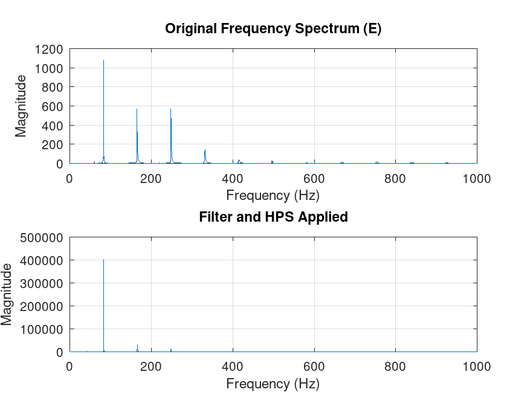

# STM32 Electric Guitar Tuner

libopencm3 and CMSIS DSP based guitar tuner, using STM32f411.


# Usage
After cloning the repo with submodules(and build libopencm3), Compile the code then flash the \
binary to your ST-link:
```
cd guitarTuner
make
make flashbin
```
After that you will probably have to unplug and plug again your ST-link,and that is it, now if your \
connections are right you will see the nearest note, frequency detected and a bar that shows how \
far you are from the note.

# Connections
```
Display SDA >> B7 stm32 pin
Display SCL >> B6 stm32 pin 
Display VCC and GND >> stm32 VCC and GND
Guitar Signal Amplified >> A1 stm32 pin
Guitar Signal GND >> stm32 GND
```
It's recommended to put a 4.7k resistor between SDA and VCC and another between SCL and VCC. 
# How it works
## Signal Amplification
First, the weak signal from the magnetic guitar pickups needs to be amplified so that the microcontroller \
can understand it. \
Using lm358 opamp is a good idea, you can follow the diagram:


## Samples Storage
When the adc conversion is done, it generates an interrupt that stores the sample in a ring  buffer \
allowing the samples to be written and processed at same time, the sample rate and frame lenght were \
chosen taking into consideration Nyquist, sampling resolution and MCU limitations.
## Signal Processing
The signal processing was done in 5 steps:\
1.Windowing and Normalization:\
   Signal is normalized to be in a range between 0 and 1 and then hanning windowing is applied to avoid \
   spectral leak.\
2.FIR:\
	Pass band FIR filter is applied to get only frequencies between 60 and \
3.FFT:\
	Fourier Fast Transform to transform the signal from the time domain to the frequency domain.\
4.Magnitude:\
	from the FFT, the magnitude of the frequencies are calculated.\
5.HPS:\
	Harmonic Product Spectrum is applied to get the only the right octave from the buffer.\
The Difference between before and post filter and HPS can be seen below:\


	
